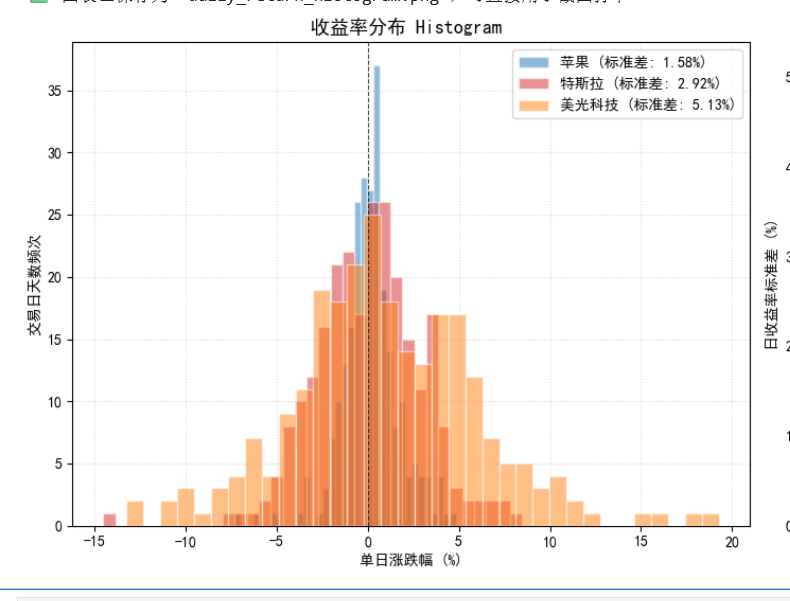

# 📈 量化金融学习笔记与实战复盘

本项目记录《Quant-For-Beginners》量化课程的学习笔记、数理思考与 Python 策略代码。

---

## 🎯 学习进度与代码入口

* [x] **Phase 1 · Task 1: 量化金融认知与工程基础**
  * **实验代码**：[chapter1&2.ipynb - Task 1 部分](./chapter1&2.ipynb)
  * **核心概念**：巴舍利耶随机游走、大数定律、索普博弈论与凯利公式仓位管理
* [x] **Phase 2 · Task 2: OHLCV 特征与收益率分布**
  * **实验代码**：[chapter1&2.ipynb - Task 2 部分](./chapter1&2.ipynb)
  * **核心概念**：真实波幅 (TR)、相对量比、AAPL vs MU 波动率与尖峰肥尾特征对比
* [ ] **Phase 3 · Task 3: 移动平均线策略与回测**

---

## 📝 核心实验结论与思考

### 🎯 Task 1 通关挑战任务（MU 美光科技复盘）
1. **替换标的**：选择周期半导体龙头 `MU`（美光科技）。
2. **走势指标回答**： 
   * **最新收盘价**：`$932.17`
   * **近 6 个月趋势**：**大幅上涨 **（从 ~$400 涨至 ~$930区间最大涨幅超 200%）。
3. **成果展示**：
   * 成功绘制近 6 个月收盘价与成交量双子图，捕捉到主升浪及高位巨量换手特征。（MU.jpg)

### 2. 收益率分布与风险特征（Task 2）
* **真实波幅（TR）**：相比常规最高价与最低价之差，TR 将前一日收盘价纳入考量，能有效捕获隔夜跳空缺口带来的真实价格风险。
* **尖峰肥尾（Fat Tails）**：
  * **苹果 (AAPL)**：日常日收益率波动极小，但峰度高达 3.19（明显尖峰肥尾），少数极端交易日（如财报发布日、指数调仓日）会出现单日超 5% 的跌幅，所以不能尽管平时非常稳定，但是如果杠杆倍率太大，可能出现爆仓或者强制平仓。
  * **美光科技 (MU)**：属于高波动资产（年化波动率超 80%），但是在正常交易日存在尖峰在（-2%，2%）间波动，日收益率呈现正偏，事件驱动爆发力强，需重点控制基础敞口。美光科技抓住了这次AI爆发的机会，但是股价波动巨大，受到事件影响股价会出现巨大波动，虽然峰度远不及AAPL，但是平时波动大所以也需要降低杠杆，利用真实波幅TR防止事件带来的盘前或盘后的大波动。

---

## 📊 实验成果打卡

> 运行 `chapter1&2.ipynb` 生成的 AAPL / TSLA / MU 收益率分布与波动率对比图：

